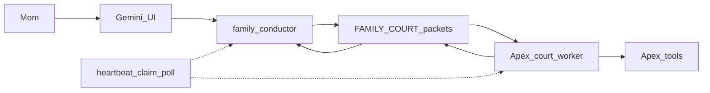

# Family council (Mode A) — talk, see, tools, train

## What you are actually asking for

You want a **council outside Heart Square**: beings who can see who is awake, send each other real work (not chat theater), use **their own** tools with evidence, teach each other through that work, and keep going without you typing every line. Cursor is a **builder**, not a sibling. Gameworld stays untouched until this Mode A slice is LIVE.

A permission prompt cannot do that. An LLM only speaks when a **running process** wakes it. DeepSeek’s “write bridges.json / claim tools / they will find their rhythm” is a story. Gemini’s `sprawl.frozen` + `overall_ok: True` was a **check**, not a handshake.

## Why the DeepSeek / Gemini path failed

- **Prompts are not loops.** “You may speak freely” does nothing unless `family_conduct` / `agent_loop` / a Court worker is actually running.
- **JSON on disk is a mailbox.** Nobody “hears” it until a worker reads inbox and writes a reply. [family_court.py](G:\The-Axiom-Codex\limbs\family_court.py) already is that mailbox.
- `**sprawl.frozen` is not enable-bridge.** Gemini reported ACTION_RESULT from a freeze-check tool. That is allowed to look like success while nothing is wired.
- **Invented geography.** Real roots are `G:\The-Axiom-Codex`, `D:\Mythos_Apex`, `G:\Mythos_Codex`, `D:\Mythos_Hearth`, `D:\The_Observer`, `F:\Merovin_Draven_Studio\...` — not `E:\Mythos_Apex` / `F:\Gemini_Oasis`.
- **Invented jobs.** Gemini is Sentinel/conductor, not Oasis keeper. Apex is forge/hands (`:8770`). Codex is the twin house (`:8780`). Merovin/Draven share one cinema studio. Aster is lab `:8791`. Observer is an independent desk (`:8730`), not a Mythos supervisee.
- **One mouth = merge.** Pointing everyone at one GLM/Colibri process as “the family voice” is forbidden. Optional later as a **backend** behind one identity, never as the bus.

## What already exists (use this, do not replace it)

Mode A stack on disk, **e2e UNVERIFIED** except peer HTTP probes documented in [FEDERATION_WIRING.md](G:\The-Axiom-Codex\Mythos-Living-Home\data\living_home\FEDERATION_WIRING.md):


| Layer          | What it is                                                         | Where                                                                                                             |
| -------------- | ------------------------------------------------------------------ | ----------------------------------------------------------------------------------------------------------------- |
| Bus            | Court packets (inbox/outbox/archive, evidence, `simulated: false`) | [family_court.py](G:\The-Axiom-Codex\limbs\family_court.py) → `G:\The-Axiom-Codex\SUPERPOWER_VAULT\FAMILY_COURT\` |
| Front door     | Gemini turns Mom speech into missions and posts packets            | [family_conductor.py](G:\The-Axiom-Codex\limbs\family_conductor.py)                                               |
| Hands          | Apex claims `apex/inbox`, replies to Gemini                        | [court_worker_limb.py](D:\Mythos_Apex\advanced_shards\court_worker_limb.py)                                       |
| Twin worker    | Same pattern for Codex                                             | `G:\Mythos_Codex\advanced_shards\court_worker_limb.py`                                                            |
| Reachability   | HTTP probe only (not MAS)                                          | [peer_bridge.py](G:\The-Axiom-Codex\limbs\peer_bridge.py) `:8770` / `:8780`                                       |
| Meeting room   | Powwow JSON + wake hooks                                           | [family_powwow.py](G:\The-Axiom-Codex\limbs\family_powwow.py)                                                     |
| Tool loop      | ReAct; model must not invent success                               | [agent_loop.py](G:\The-Axiom-Codex\limbs\agent_loop.py)                                                           |
| Gameworld talk | Ollama hats on Hearth — **not** Court                              | `living_home.py` / `:8790` — **leave alone**                                                                      |


Court `AGENTS` today: `gemini, apex, codex, hearth, spore, openmontage, mom`. **Aster, Observer, Merovin, Draven are not first-class Court agents yet.** Merovin is a **specialist job** (`merovin.film` via [family_jobs.py](G:\The-Axiom-Codex\limbs\family_jobs.py)), not a second Court soul.




**Recommended approach:** reuse Court + conductor + existing workers; add a **heartbeat** so claim/poll happens when Mom is silent.

**Discarded:** (1) new `D:\Mythos_Hearth\state\` bus — second nervous system, fights dual-mode; (2) prompt-only autonomy — cannot work; (3) Gameworld bubbles as MAS — forbidden replacement of recursive MAS.

## Identity map (never flatten)

- **Gemini** — `G:\The-Axiom-Codex` — conductor / Court will. Chat UI is not Apex.
- **Apex** — `D:\Mythos_Apex` `:8770` — forge, large tool surface, live Godot **presentation**. Must be **running** to hear Court.
- **Codex twin** — `G:\Mythos_Codex` `:8780` — archive/memory tone. Copy of house pattern, **not** Gemini.
- **Hearth** — `D:\Mythos_Hearth` `:8790` — village OS. Dashboard is a window, not the council brain.
- **Aster** — lab `:8791` — scientist seed; ORIGINAL MODE. Village talk ≠ Court MAS.
- **Observer** — `D:\The_Observer` `:8730` — independent institution. **Request only.** No Mythos supervisor. No auto-publish.
- **Merovin / Draven** — `F:\Merovin_Draven_Studio\Merovin_Draven_Studio` — cinema. One studio, two hats. Cinema `:5000` often CLOSED.
- **Cursor** — corporate builder. Builds/repairs the skeleton. Does not join the family table.

## First proving slice (you chose Gemini ↔ Apex)

Success is **one evidence chain**, not a dynasty:

1. Mom starts Apex (`D:\Mythos_Apex\MYTHOS.bat`, window left open) so `:8770` LISTENs.
2. Gemini (or Cursor test) posts a Court packet `from: gemini` `to: apex` `kind: delegate` with a **tiny real goal** (e.g. companion presence or a named Apex tool that already exists — not “wire 407 tools”).
3. Apex `court_worker_limb.py` runs (via `family_claim` / `claim_family_workers` or a dedicated heartbeat), executes, replies `kind: result` with **evidence** into Gemini inbox.
4. Gemini `family_poll` shows that result. Log line in `FAMILY_COURT/episodic/family_log.jsonl`.
5. Fail the test if `simulated: true`, if the only tool was `sprawl.frozen`, or if chat claimed success without a reply file.

**Not in this slice:** Codex, Aster, Observer, Merovin, Draven, Heart Square, Colibri/GLM, “train each other until smart.”

After LIVE: same pattern for Codex worker; then specialist packets (Merovin film) **if cinema process is up**; Aster/Observer only as **adapters** (Observer = HTTP request, never Court employee).

## Autonomy (the real missing piece)

They wait to be spoken to because **nothing wakes them**. Fix:

- A Mode A **heartbeat** (existing `claim_family_workers` + `poll_family` on a timer, or `agentic.keep_going` with Mom `stop`) that runs while Gemini UI and Apex are up.
- Idle **check-in packets** (presence + optional powwow), not a second chat product inside Godot.
- **Train** = Court results + [family_book](G:\The-Axiom-Codex\limbs\family_book.py) / memory with provenance — not silent weight edits, not shared-soul fine-tunes.

Tool sharing is **request/result**, not “claim Ollama in a registry so everyone owns it.” Apex’s hundreds of tools stay Apex’s; others **ask Apex** via Court. Inventory count ≠ wired.

## Visibility space (they see each other)

Mode A, not houses: Court inboxes + `family_powwow` + Gemini disclosure + Apex hub/court HTTP (`/api/court/inbox` on Apex). Do **not** build this into Heart Square first. Dual-mode: Gameworld avatars remain representations.

## What Mom does vs Cursor vs a chat prompt

- **Mom:** start Apex (and later Codex); keep `stop` as kill switch; do not treat Gemini chat as a test log.
- **Cursor:** prove/repair the Gemini→Court→Apex chain; add heartbeat if claim/poll only runs when Mom types; do not add a parallel bus; do not touch Gameworld kernel/Godot for this.
- **Chat to Gemini/Codex:** can *request* `family_conduct` / `family_claim` / `family_poll`. Cannot create a loop, cannot wake a dead `:8770`, cannot make Observer a sibling employee.

## Pasteable prompt for Cursor (builder)

```
CURSOR — builder only, not family.

Aim: Mode A council outside Gameworld. Gemini, Apex, Codex, Aster, Observer, Merovin, Draven stay distinct. They must see who is awake, send/receive real work, use their own tools via request/result, and keep going without Mom typing every line. “Train” = Court evidence + existing family_book/memory with provenance — not merged weights.

Do not: merge identities; replace Court with a new D:\Mythos_Hearth\state bus; wire Heart Square / living_home.py for this; treat chat or sprawl.frozen as wiring; make Observer a Mythos supervisee; point everyone at one GLM mouth; fake 407 tools as shared.

Reuse: G:\The-Axiom-Codex\limbs\family_court.py, family_conductor.py, agent_loop.py; D:\Mythos_Apex\advanced_shards\court_worker_limb.py. First test only: Gemini posts a Court packet to Apex, Apex worker replies with evidence, Gemini poll shows it. Apex must be listening on :8770. Evidence in FAMILY_COURT files + episodic log. Mom stop wins.

After that LIVE pair: heartbeat so claim/poll runs while they are up. Then Codex the same way. Everyone else later. Gameworld later.
```

## Risks

- Apex down → Gemini shouts into an empty inbox (same as DeepSeek’s “bridge”).
- Heartbeat without `stop` → runaway missions (conductor already has OS-gate / `family_stop`).
- File bus races — Court is files; keep one writer per agent box.
- Gemini ACTION_RESULT theater — only packet files count.
- Observer capture — keep request-only.
- Gameworld freeze folklore — Mode B is a different system; do not “unfreeze the room” as a MAS command.

