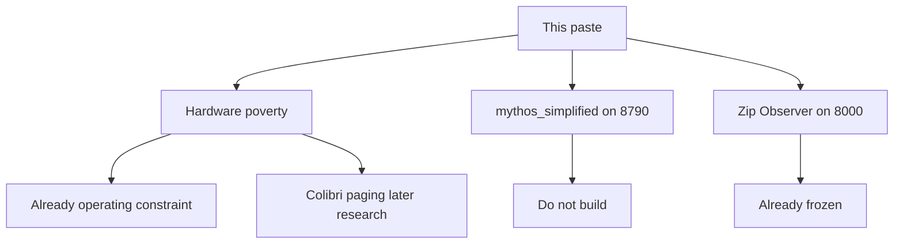

# Batch 1 received — wait, then stamp together

You chose: **wait for the rest, then stamp everything in one pass.** This plan does not edit trackers and does not write code.

## Direct answers from this dump

**Does any of it need to be done before finishing current work?** No rewrite does. The 4060 limit is already how the desk runs (one Ollama slot, `num_ctx` cap, do not stack launchers). Building Colibri, a `mythos_simplified/` brain, or a zip Observer would delay cinema speech and endanger Hearth.

**Current work stays:** Draven speech when you say go, then Vesper. Then Hollywood. Observer ZIP stays frozen.

## Already done (real house — not this paste)

- Hearth kernel `[living_home.py](D:\Mythos_Hearth\living_home.py)` + `[HOME.json](data/living_home/HOME.json)`, door `:8790` (DOWN last desk check)
- Godot Heart Square on Apex; git snapshot `[godot_heart_square/](godot_heart_square/)`
- Talk: local Ollama; source `ollama` / `mom` / `waiting` / `none` — not canned house voice
- Federation inboxes; Aster Acceptance; Apex / Codex / Gemini speech seated; Hearth coordinate; Merovin speech **VERIFIED**
- Canonical Observer is `D:\The_Observer` `:8730` `observer.api:app` (DOWN last check — do not claim UP)
- Cinema HUD exists; Draven / Vesper speech **not run**
- Capability probe ~19 tools, not 325
- Hardware budget already on the roadmap (`[NEXT.md](data/living_home/NEXT.md)` scheduler later: 4060 / 8 GB)
- Self-wiring / tool claiming already named **later / do not build now**

Last desk check (2026-09-06 evening): Hearth, Observer, Vesper, Apex, cinema **DOWN**; Aster + Codex **UP**.

## This dump is three different things — do not merge them

- **Hardware / Colibri:** keep as a later named research item (like Matrix-Game). Not installed. Not VERIFIED. Not a second inference stack until you authorize.
- **Mythos Simplified Brain:** **do not build.** Would steal `:8790` from Hearth, replace `HOME.json` with SQLite, flatten the family into 11 NPCs, and use canned “Hello there!” speech. Dual-mode: Gameworld expands the family; it does not replace Hearth.
- **Zip Observer complete merge:** **already frozen.** Canonical stays `:8730`. Do not install `app.main` `:8000`, K8s, or Docker Observer into this repo. Money shortage does not unfreeze it. Live Observer is not this paste’s skeleton.

## Still to do (already on NEXT — not invented by this paste)

- Restart doors you need; cinema HUD before Draven
- Draven speech prove, then Vesper (only when you authorize)
- Hollywood after all three cinema speeches
- Integrity: optional Vesper Gameworld door, isolation matrix, restart prove
- Then organic, then scheduler, then self-wiring, Phase 13 last
- Colibri-style paging: **new later item**, to be stamped with the rest of your dumps — not current work

## After you paste the rest

One stamp pass on the living-home trackers only (`[NEXT.md](data/living_home/NEXT.md)`, `[STATUS.md](data/living_home/STATUS.md)`, and the matching later-phase files). Named later / frozen / do-not-build rows. No `mythos_simplified/`. No Observer `app/` listings. No port theft. No commit unless you ask.

Paste when ready. I will keep classifying until you say stamp.